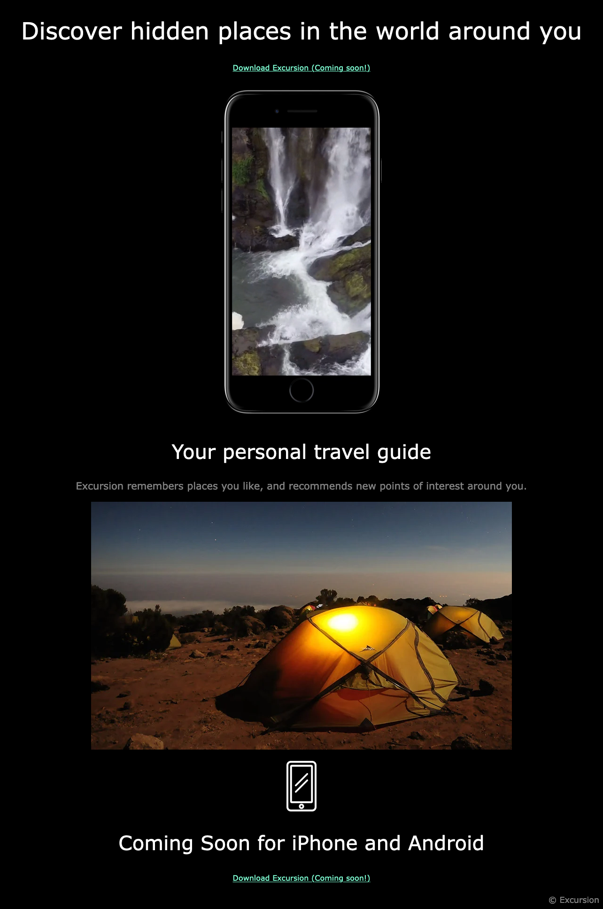

# CodeCademy Project: Excursion

This is my solution to the Excursion challenge in CodeCademy's Build a Website with HTML, CSS, and Github Pages Course

## Table of contents

- [Overview](#overview)
  - [The challenge](#the-challenge)
  - [Screenshot](#screenshot)
  - [Links](#links)
- [My process](#my-process)
  - [What I learned](#what-i-learned)
  - [Continued development](#continued-development)

## Overview

### The challenge

"Project Goals

In this project, you’ll create a web page which advertises a product called “Excursion.” You’ll use your growing toolset including HTML, CSS, Command Line Interface, Git, and GitHub. You’ll be proud of yourself when it all comes together!

The web page we’ll build advertises a mobile app which helps users record and share their experiences, so we’ll use video and landscape imagery to set the scene. A landing page is a vital tool in marketing a product these days, and the goal will be to entice potential customers into using the product."

-CodeCademy

### Screenshot

### Links

- Live Site URL: [Excursion](https://andyferrie.github.io/Excursion/)

## My process

### What I learned

Building this page I learned how to embed an autoplaying and looping video. CodeCademy also suggested placing an image in 
 tags as a simple way of placing an image on a new line.

### Continued development

I would like to experiment more with video.